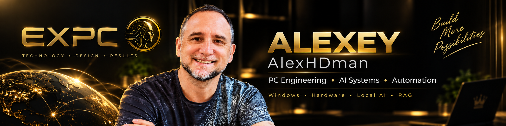

  

### PC Engineer • System Integrator • AI Solutions Developer

**Windows • Hardware • Local AI • RAG • Automation • AI-powered software**

Krasnodar, Russia

---

## Featured Projects

  

  

---
# 🇬🇧 English

## About Me

I'm Alexey, a PC engineer, system integrator, and AI solutions developer with more than 30 years of practical experience in computer hardware, diagnostics, repair, modernization, Windows systems, networking, and technical support.

Today, my main focus is the development of practical **local AI systems**, intelligent desktop tools, RAG solutions, business automation, and AI-assisted workflows.

I prefer engineering solutions that are **reliable, understandable, maintainable, and useful in real-world work**.

## Current Projects

**AI Switcher**  
Native Windows keyboard layout correction and intelligent text correction system with optional local AI.

**WhisperKey WLK**  
Local speech-to-text system based on Whisper with GPU acceleration, custom vocabulary, hotkeys, and portable deployment.

**VisualMind**  
AI-powered visual workflow and creative generation system.

**WinRepair Pro**  
Portable Windows diagnostics, repair, and recovery toolkit.

**EXPC**  
Professional PC systems, diagnostics, service workflows, AI integration, and technology solutions.

**EXPC NewsBot**  
Automated technology news processing and Telegram publishing workflow.

## Technologies & Areas

`Windows` · `C++` · `Python` · `PowerShell` · `Git` · `GitHub`

`Local LLM` · `Whisper` · `RAG` · `llama.cpp` · `AI Automation`

`PC Hardware` · `Diagnostics` · `Networking` · `Windows Server`

---

# 🇷🇺 Русский

## Обо мне

Меня зовут Алексей. Я инженер по ПК, системный интегратор и разработчик AI-решений. Более 30 лет занимаюсь компьютерным оборудованием, диагностикой, ремонтом и модернизацией ПК, Windows-системами, сетями и технической поддержкой.

Сегодня основное направление моей работы — разработка практических **локальных AI-систем**, интеллектуальных Windows-приложений, RAG-решений, автоматизация бизнеса и интеграция искусственного интеллекта в реальные рабочие процессы.

Предпочитаю инженерные решения, которые **надёжны, понятны, сопровождаемы и действительно полезны в работе**.

## Текущие проекты

**AI Switcher**  
Нативная Windows-система автоматического исправления раскладки и интеллектуальной коррекции текста с поддержкой локального AI.

**WhisperKey WLK**  
Локальная система распознавания речи на базе Whisper с GPU-ускорением, пользовательским словарём, горячими клавишами и portable-развёртыванием.

**VisualMind**  
AI-система для визуальных и творческих рабочих процессов.

**WinRepair Pro**  
Портативный комплекс диагностики, ремонта и восстановления Windows.

**EXPC**  
Профессиональные компьютеры, диагностика, сервисные технологии и интеграция AI.

**EXPC NewsBot**  
Автоматизированная система обработки технологических новостей и подготовки публикаций для Telegram.

## Технологии и направления

`Windows` · `C++` · `Python` · `PowerShell` · `Git` · `GitHub`

`Local LLM` · `Whisper` · `RAG` · `llama.cpp` · `AI Automation`

`PC Hardware` · `Diagnostics` · `Networking` · `Windows Server`

---

### EXPC Design and Production

**Krasnodar • Russia**

